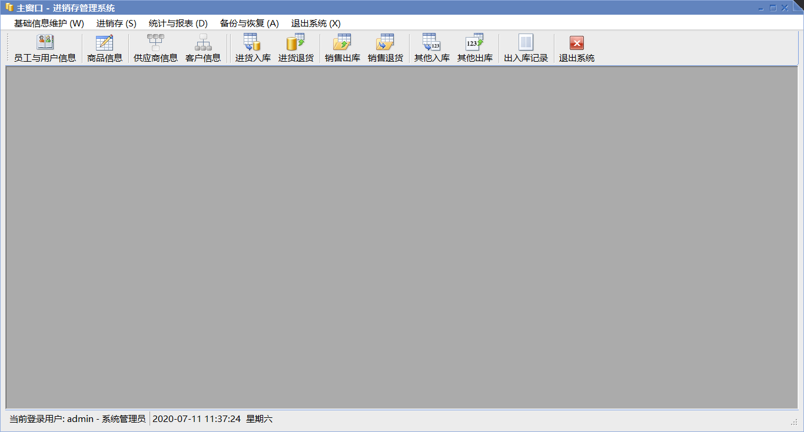
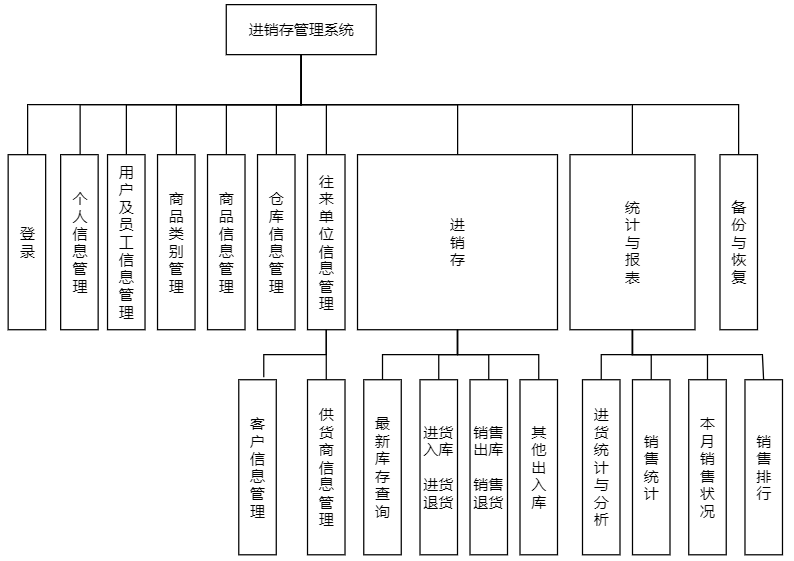

# ERP
2019-2020-2学期-面向对象课程设计(C#)-进销存管理系统

该进销存管理系统作为2019-2020-2学期的面向对象课程设计，开发完成时间：2020年07月，开发+报告撰写约两周。由于时间紧迫，与功能模块的要求，并未对完整的ERP功能进行实现。下面进行具体介绍。

进销存管理系统是基于C/S结构、C#开发语言、Visual Stadio开发环境以及SQL Server数据库管理系统进行构建开发的，利用到了三层架构。

具体实现的功能如下：

1、个人信息管理：每个用户都可以使用账号密码登录系统、更改自己密码。由于信息安全性考量，用户本身不可以修改除密码外的其他信息。

2、用户及员工信息管理：完成对用户信息及每一项权限的增改查删。

3、商品类别及信息维护：完成对商品类别、商品详细信息的增改查删。

4、仓库信息维护：完成对仓库详细信息的增改查删。

5、往来单位信息维护：完成对供应商和客户详细信息的增改查删。

6、进销存功能：最新库存查询、进货入库、进货退货、销售出库、销售退货、其他入库、其他出库和出入库记录查询等功能。

7、统计与报表：进货统计与分析、销售统计、本月销售状况、销售排行等功能的完成。 

8、恢复与备份功能：本功能为扩展功能，可以将数据库数据备份到文件及将文件恢复到数据库。利用此功能可以避免意外导致的数据损失。

上述功能2~7均额外扩展了导出Excel报表或图表文件的功能。

程序源代码：“进销存管理系统”文件夹中；数据库文件：“进销存管理系统.sql”，数据库配置在“App.config”中。
